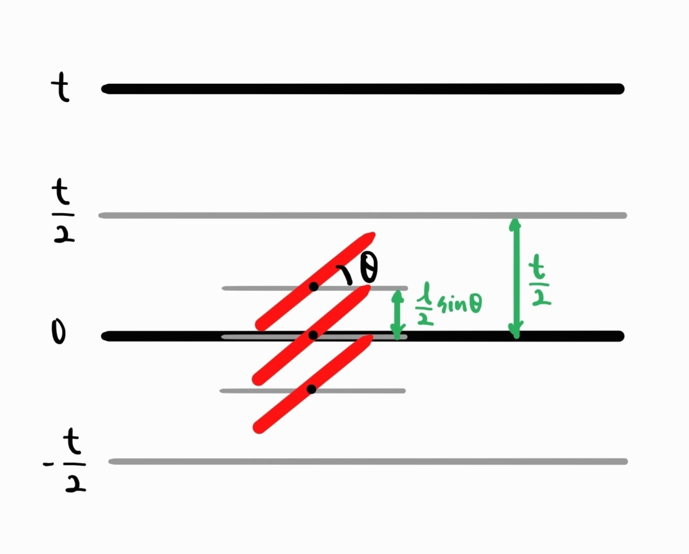
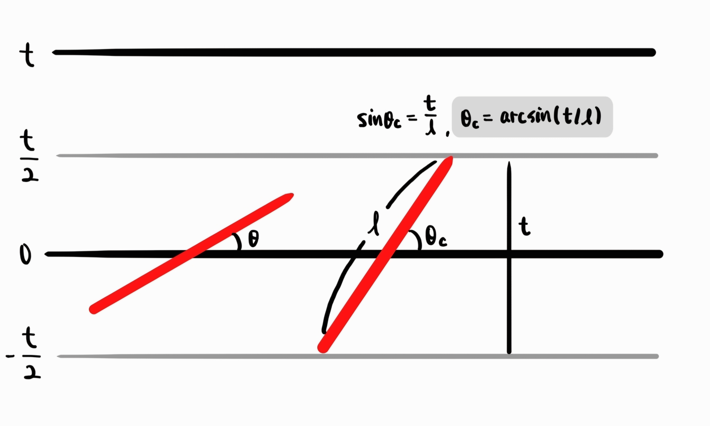

# Buffon's needle problem - calculating π

## 1. $\ l \leq t$

$f_{x}(x) = \begin{cases}\frac{2}{t} & (0\leq x\leq\frac{t}{2} )\\ 0 &   elsewhere \end{cases} , \quad  f_{\theta}(\theta) = \begin{cases}\frac{2}{\pi} & (0\leq \theta\leq\frac{\pi}{2} )\\ 0 &   elsewhere \end{cases}$

→ $f_{x,\ \theta} (x, \theta) = \begin{cases}\frac{2}{t}\cdot\frac{2}{\pi} & (0\leq x\leq\frac{t}{2}, \ 0\leq \theta\leq \frac{2}{\pi})\\ \ 0 &   elsewhere \end{cases}$

$\newline$

$P = \iint f_{x, \theta} (x, \theta)$

$\quad = \int_{0}^{\frac{\pi}{2}}\int_{0}^{\frac{l}{2}sin\theta}{\frac{4}{t\pi} \ dxd\theta}$

$\quad = \int_{0}^{\frac{\pi}{2}}{\frac{2lsin \theta}{t\pi} \ d\theta}$

$\quad =\frac{2l}{t\pi}[\ -cos\theta\ ]_{0}^{\frac{\pi}{2}} \ =\frac{2l}{t\pi} = P$

$\newline$

$\quad ∴ \pi = {\large \ \frac{2l}{tP}}$

$\newline$

## 2. $\ l > t$

$f_{x}(x) = \begin{cases}\frac{2}{t} & (0\leq x\leq\frac{t}{2} )\\ 0 &   elsewhere \end{cases}, \quad f_{\theta}(\theta) = \begin{cases}\frac{2}{\pi} & (0\leq \theta\leq\frac{\pi}{2} )\\ 0 &   elsewhere \end{cases}$

→ $f_{x,\ \theta} (x, \theta) = \begin{cases}\frac{2}{t}\cdot\frac{2}{\pi} & (0\leq \theta\leq \theta_{c})\\ 1\cdot\frac{2}{\pi} & (\theta_{c}\leq \theta\leq \frac{\pi}{2}) \end{cases}$

$\newline$

$P = \iint f_{x,\ \theta} (x, \theta)$

$\quad = \int_{0}^{\theta_{c}}\int_{0}^{\frac{l}{2}sin\theta}{\frac{4}{t\pi} \ dxd\theta}$ + $\int_{\theta_{c}}^{\frac{\pi}{2}}{\frac{2}{\pi} \ d\theta}$

$\quad = \frac{2l}{t\pi}\int_{0}^{\theta_{c}}{sin\theta \ d\theta}$ + $\int_{\theta_{c}}^{\frac{\pi}{2}}{\frac{2}{\pi} \ d\theta}$

$\quad =\frac{2l}{t\pi}[\ -cos\theta\ ]_{0}^{arcsin(t/l)}$ + $1-\frac{2}{\pi} \ arcsin(t/l)$

$\quad *) -cos\theta\ = -\sqrt{1 - sin^{2}\theta} = -\sqrt{1 - sin^{2}({sin^{-1}(t/l)})} = -\sqrt{1 - (t/l)^2}$

$\quad =\frac{2l}{t\pi}(\ -\sqrt{1-(t/l)^2}+1\ ) \ + 1-\frac{2}{\pi}\ arcsin(t/l)$

$\quad =-\frac{2}{t\pi}\sqrt{l^2-t^2}$ + $\frac{2l}{t\pi}+\frac{2}{t\pi}\ (-t \cdot arcsin(t/l)) +1$

$\quad =\frac{2}{t\pi}( -\sqrt{l^2-t^2} +l-t \cdot arcsin(t/l)\ )+1 = P$

$\newline$

$\quad ∴ \pi = {\large \ \frac{ -\sqrt{l^2-t^2} + \ l \ - \ t \cdot arcsin(t/l)} {t(P/l)}}$
